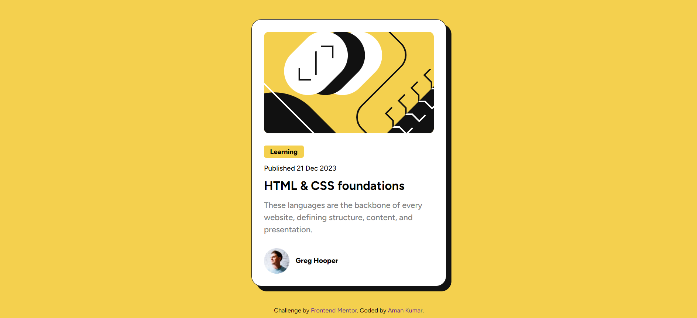
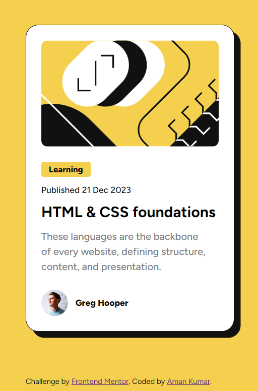

# Frontend Mentor - Blog preview card solution

This is a solution to the [Blog preview card challenge on Frontend Mentor](https://www.frontendmentor.io/challenges/blog-preview-card-ckPaj01IcS). 

## Table of contents

- [Overview](#overview)
  - [The challenge](#the-challenge)
  - [Screenshot](#screenshot)
  - [Links](#links)
- [My process](#my-process)
  - [Built with](#built-with)
  - [What I learned](#what-i-learned)
  - [Useful resources](#useful-resources)
- [Author](#author)

## Overview

### The challenge

Users should be able to:

- See hover and focus states for all interactive elements on the page

### Screenshot

- Destop view

- Mobile view

### Links

- Solution URL: [Repo](https://github.com/amankr794/frontend-mentors/tree/3b59dec382c12bfffa6014e67167e35e01e1a1da/blog-preview-card-main)
- Live Site URL: [Live](https://akr-blog-preview-card.netlify.app)

## My process

### Built with

- Semantic HTML5 markup
- CSS custom properties
- Flexbox
- CSS Grid

### What I learned
I learnt how to use css flexbox and grid very well . While working on cool project I had fun and i also improved my foundation of css.

### Useful resources

- [CSS TRICKS](https://css-tricks.com/snippets/css/a-guide-to-flexbox/) - This helped me to learn flexbox concepts.
- [w3schools ](https://www.w3schools.com/html/html5_semantic_elements.asp) - This is an amazing article which helped me to learn Semantic HTML5 markup . I'd recommend it to anyone still learning this concept.

## Author

- Frontend Mentor - [@amankr794](https://www.frontendmentor.io/profile/amankr794)
- Twitter - [@Amankr489589Kr](https://twitter.com/Amankr489589Kr)

