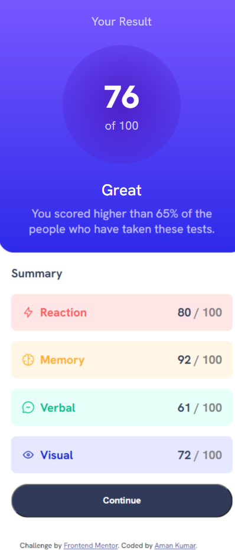

# Frontend Mentor - Results summary component solution

This is a solution to the [Results summary component challenge on Frontend Mentor](https://www.frontendmentor.io/challenges/results-summary-component-CE_K6s0maV). Frontend Mentor challenges help you improve your coding skills by building realistic projects. 

## Table of contents

- [Overview](#overview)
  - [The challenge](#the-challenge)
  - [Screenshot](#screenshot)
  - [Links](#links)
- [My process](#my-process)
  - [Built with](#built-with)
- [Author](#author)
## Overview

### Screenshot

- Destop view

- Mobile view 

### Links

- Solution URL: [Repo](https://github.com/amankr794/frontend-mentors/tree/main/results-summary-component-main)
- Live Site URL: [Live](https://ak-results-summary-component.netlify.app/)

## My process

### Built with

- Semantic HTML5 markup
- CSS custom properties
- Flexbox
- CSS Grid
- Mobile-first workflow

## Author

- Frontend Mentor - [@amankr794](https://www.frontendmentor.io/profile/yourusername)
- Twitter - [@Amankr489589Kr](https://twitter.com/Amankr489589Kr)

