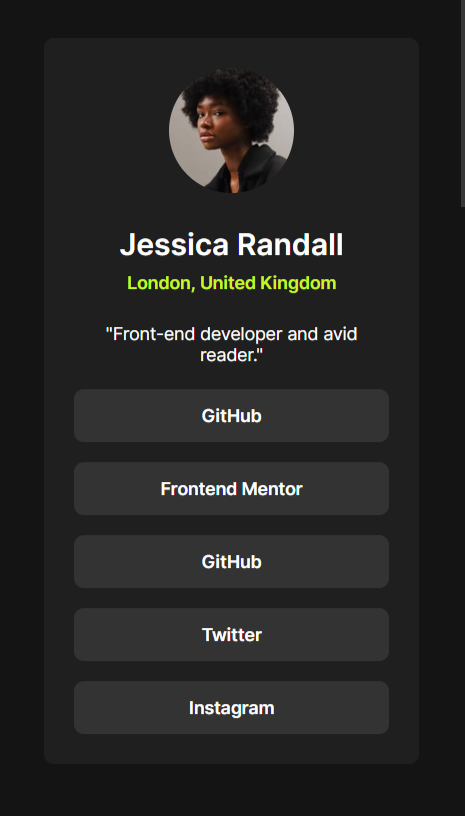

# Frontend Mentor - Social links profile solution

This is a solution to the [Social links profile challenge on Frontend Mentor](https://www.frontendmentor.io/challenges/social-links-profile-UG32l9m6dQ). Frontend Mentor challenges help you improve your coding skills by building realistic projects.

## Table of contents

- [Overview](#overview)
  - [The challenge](#the-challenge)
  - [Screenshot](#screenshot)
  - [Links](#links)
- [My process](#my-process)
  - [Built with](#built-with)
  - [Useful resources](#useful-resources)
- [Author](#author)

## Overview

### The challenge

Users should be able to:

- See hover and focus states for all interactive elements on the page

### Screenshot

- Desktop view
  

- Mobile view
  

### Links

- Solution URL: [Repo](./social-links-profile-main)
- Live Site URL: [Live](https://ak-social-links-profile.netlify.app/)

## My process

### Built with

- Semantic HTML5 markup
- CSS custom properties
- Flexbox
- CSS Grid
- Mobile-first workflow

### Useful resources

- [Responsive Design](https://fedmentor.dev/posts/responsive-meaning/)
- [CSS-TRICKS](https://css-tricks.com/snippets/css/complete-guide-grid/)
- [CSS reset](https://piccalil.li/blog/a-more-modern-css-reset/)

## Author

- Frontend Mentor - [@amankr794](https://www.frontendmentor.io/profile/amankr794)
- Twitter - [@Amankr489589Kr](https://twitter.com/Amankr489589Kr)
